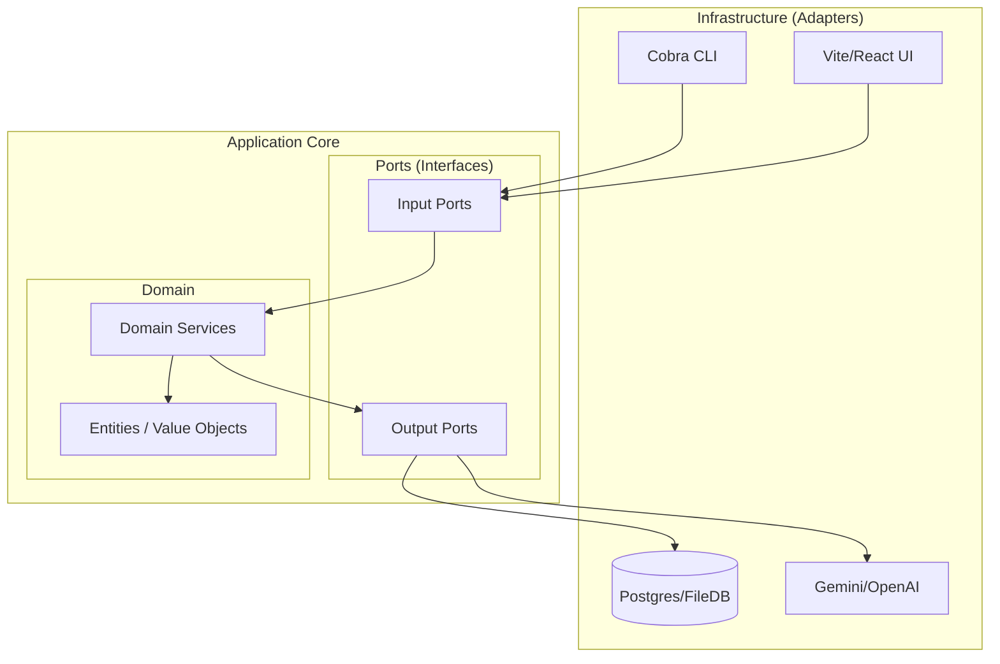

# Architecture & Design: The Hexagonal Foundation

This document details the architectural standards for our "Gold Standard" projects, focusing on decoupled domain logic, strictly typed interfaces, and extensible plugin systems.

## 1. Hexagonal Architecture (Ports & Adapters)

The core principle is the isolation of **Domain Logic** from **Infrastructure**.

### 🏗️ Visualizing the Hexagon



### Key Rules:
1.  **Dependency Rule:** Dependencies only point *inwards*. The Core (`internal/core`) must never import from Adapters (`internal/adapters`) or external frameworks (e.g., Cobra, Gorm).
2.  **Ports as Contracts:** Every interaction with the outside world must happen through an interface defined in `internal/core/ports`.
3.  **No Magic:** Do not use `init()` functions or global state. All dependencies (Adapters) must be injected into Services via constructors.

---

## 2. Directory Structure

A standardized layout ensures that any developer (or AI) can navigate the project immediately.

*   `cmd/`: Entry points for applications (e.g., `cmd/pac-cli`). Minimal logic; just wiring.
*   `internal/core/`:
    *   `domain/`: Pure entities and business logic.
    *   `ports/`: Interface definitions.
    *   `services/`: Orchestration logic that implements ports or uses them.
*   `internal/adapters/`: Implementations of ports (Filesystem, AI, External APIs).
*   `configs/schema/`: Cuelang definitions for configuration and state validation.
*   `docs/meta/`:
    *   `REPO_STRUCTURE.md`: A "Map" of the current repository.
    *   `WORKFLOW_SOP.md`: The "How-To" for project-specific tasks.

---

## 3. Plugin System (Registry Pattern)

To ensure the "Open/Closed Principle," we use a Registry pattern for extensibility.

### The Pattern:
1.  **Define a Strategy Interface:** (e.g., `IngestorStrategy`).
2.  **Create a Registry Service:** A struct holding a map of strategies.
3.  **Registration:** Adapters register themselves into the registry during the wiring phase in `main.go`.

```go
// Port definition
type Strategy interface {
    Execute(ctx context.Context, data []byte) error
}

// Registry in Core
type Registry struct {
    strategies map[string]Strategy
}

func (r *Registry) Register(name string, s Strategy) {
    r.strategies[name] = s
}
```

---

## 4. AI Integration Patterns

In our ecosystem, Large Language Models (LLMs) are **Infrastructure**, not the application itself.

*   **LLM as Adapter:** The AI Provider is just another implementation of an `AIPort`. Swapping Gemini for OpenAI should require zero changes to domain logic.
*   **State-First Manipulation:** Agents do not "chat." They ingest unstructured data and return **Structured State** (JSON/Cue) that matches our schema.
*   **Prompt Management:** Prompts are treated as code artifacts. They should be versioned, tested, and stored in a way that allows for "Prompt Injection" of context variables.

---

## 5. Observability & Error Handling

### Error Wrapping
We use the standard library `fmt.Errorf("...: %w", err)` to maintain a traceable chain from the Adapter back to the User.

### Domain Errors
Core services should define "Sentinel Errors" (e.g., `ErrNotFound = errors.New("resource not found")`). Adapters are responsible for translating infrastructure-specific errors (like `sql.ErrNoRows`) into these Domain errors.

### Structured Logging
Logs should be machine-readable (JSON) and include relevant context (e.g., `session_id`, `trace_id`) to allow for rapid debugging in complex agentic workflows.
