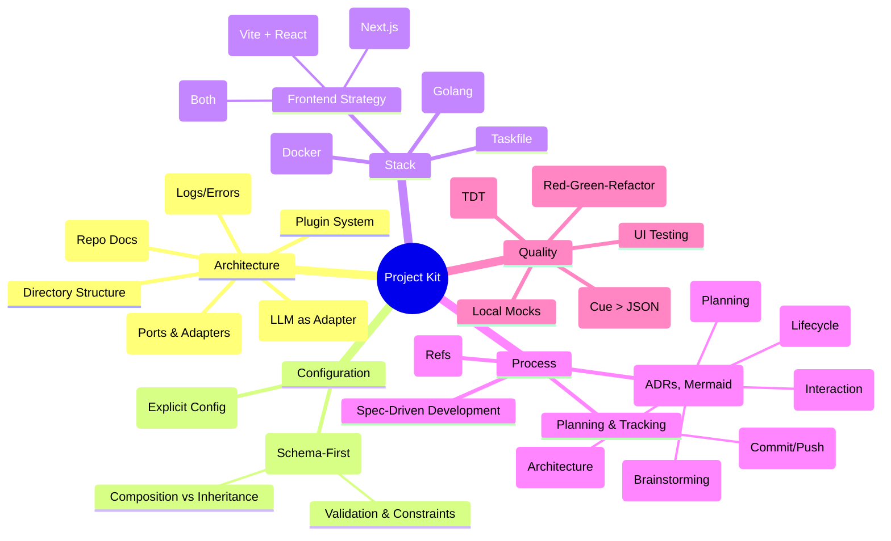

# Project Kit: Standardized Patterns & Practices

**Status Legend:** ⚪ Todo | 🟡 In Progress | ✅ Done

This "Kit" serves as the blueprint for future projects, distilling the reusable architectural decisions, workflows, and toolchains. It acts as a reference implementation for our "Gold Standard" engineering practices.

## 🚀 Getting Started
*   **[_NEW_PROJECT_INIT.md](./_NEW_PROJECT_INIT.md):** The mandatory Master Entry Point for starting a new project. It walks you through Design Clarification, Stack Selection, Planning, and Execution.
*   **[_AUDIT.md](./_AUDIT.md):** The guide for auditing existing projects to align them with "Gold Standard" patterns. Use this to identify gap analysis and modernization opportunities.

## 🧠 Visualization

## 1. Core Philosophy & Stack ✅
*   **Language Preference:** Golang (1.23+) for backend logic due to its performance, type safety, and standard library.
*   **Frontend Strategy:**
    *   **Context:** Selection is based on the specific needs of the project (SEO, Real-time, Local-first).
    *   **Hybrid Architecture:** A single project can use multiple frontend strategies (e.g., Next.js for SEO + Datastar for Admin).
    *   **Local Tool:** Use **Vite + React** (SPA).
    *   **Hosted Application:** Use **Next.js** (SSR/React Server Components).
    *   **Hypermedia/Real-time:** Use **Datastar & Gonads** for server-driven interactive UIs.
    *   **Design & Components:** Always use the **TailwindPlus MCP Server** first for design and component inspiration.
    *   **Specialized Modes:** Support **Local Dev & Demo** modes with role selection (skip login) and hierarchical data seeding.
*   **Advanced Architectural Patterns (Backend):**
    *   **Standard:** Clean Hexagonal Architecture.
    *   **Persistence:** **SQLite** is the standard for local-first development and demo environments.
    *   **Advanced:** Evaluate **Event Sourcing** and **CQRS** for complex domains requiring high auditability or diverging performance needs.
*   **Infrastructure & Containers:**
    *   **Docker:** Standard for local development environments and deployment.
    *   **Local Builds:** Use `Dockerfile` and `docker-compose.yml` to spin up dependencies (DBs, Caches) locally, ensuring "it works on my machine" means "it works everywhere".
*   **Task Management:** `Taskfile.yml` over Makefiles.
    *   *Why:* Declarative, cross-platform, parallel execution, and better readability.

## 2. Architecture & Design ✅
*   **Hexagonal Architecture (Ports & Adapters):**
    *   **Core (Domain):** Pure business logic. Zero external dependencies.
    *   **Ports:** Interfaces defining interactions (Input/Output).
    *   **Adapters:** Implementations of Ports (e.g., CLI, HTTP, Filesystem, AI Provider).
    *   *Benefit:* Testability and easy swapping of infrastructure (e.g., FileDB -> Postgres).
*   **Directory Structure:**
    *   `internal/core/`: Domain logic, Services, Ports.
    *   `internal/adapters/`: External system integrations.
    *   `cmd/`: Entry points.
    *   `configs/schema/`: Cuelang definitions.
    *   `docs/`: All documentation, plans, and specs.
    *   `docs/meta/`: Repository-level documentation. Includes `REPO_STRUCTURE.md` for architectural mapping and `WORKFLOW_SOP.md` for procedural standards.
*   **Plugin System:**
    *   **Goal:** Open/Closed Principle. Open for extension, closed for modification.
    *   **Pattern:** Registry-based discovery using strictly typed interfaces.
    *   **Ecosystem:** Enables third-party extensions without recompiling the core.
*   **AI Integration Patterns:**
    *   **LLM as Infrastructure:** treat AI models as "Adapters" (like a Database), not Magic.
    *   **Prompt Engineering in Code:** Store prompts as constants or config, not scattered strings.
    *   **State-First:** AI manipulates structured state, not just generating text.
*   **Observability & Error Handling:**
    *   **Structured Logging:** JSON logs for machine parsing.
    *   **Error Wrapping:** Maintain stack traces and context across layers (Adapters -> Core -> UI).
    *   **Domain Errors:** Typed errors in Core to allow specific handling in Adapters.

## 3. Configuration Management ✅
*   **The "No Viper" Rule:** We avoid configuration libraries that rely on global state or implicit path resolution (Magic).
*   **Cuelang vs. JSON:**
    *   **Superiority:** Cue is a logic-based language, not just a data format. It unifies values and types.
    *   **Composition & Inheritance:** Instead of massive, repetitive JSON files, we use Cue's embedding to build configurations layer by layer (e.g., `#BaseConfig` + `#EnvOverrides`).
    *   **Validation:** Constraints are enforced at the schema level (e.g., `port: int & > 1024`), ensuring invalid config never reaches the app logic.
    *   **Dryness:** "Don't Repeat Yourself" applies to data too. Define common structures once and reuse them.

## 4. Methodology & Process ✅
*   **Initial Architecture Pass:** Visual stack selection process using `ARCH_SELECTION_FORM.md` and `STACK.md` decision trees.
*   **Spec-Driven Development (SDD):**
    *   **The Chain of Truth:** User Story -> Technical Spec -> Test Case -> Implementation.
    *   *Rule:* Never write code without a Spec defining the acceptance criteria.
*   **Hyper-Linked Traceability (Refs):**
    *   **Interconnectivity:** We enforce a web of references across documentation to ensure no context is lost.
    *   **The "Ref" Tags:**
        *   **User Stories** link to -> `Spec Ref` (e.g., `docs/specs/001-login.md`).
        *   **Trackers** link to -> `Story Ref` (e.g., `US-101`) and `Test Ref` (e.g., `internal/core/auth_test.go`).
        *   **Code** comments link back to -> `Spec` sections.
    *   *Benefit:* When viewing any artifact (code, test, or story), you immediately know its origin and its verification status.
*   **Planning & Tracking:**
    *   **Master Plans:** The Strategic Vision (Why/When).
    *   **Phase Plans:** The Tactical Execution (What).
    *   **Trackers:** The Operational Status (How/Status).
    *   **Git Discipline:** Implementation Plans MUST include explicit checkpoints for "Commit & Push". This prevents work loss and ensures atomic commits that match the spec step-by-step.
*   **Documentation as Code:**
    *   **MermaidJS Strategy:** Visualizations live with the code.
        *   **Mindmap:** High-level brainstorming, "Kit" outlines, and feature exploration.
        *   **Flowchart (C4 Context/Container):** System architecture, data flow, and Hexagonal wiring.
        *   **Sequence Diagram:** Complex interactions between Agents (e.g., Ingestor -> State -> Refiner).
        *   **State Diagram (v2):** Lifecycle of the `SemanticState` (e.g., `Draft -> Verified -> Published`).
        *   **Gantt:** Project timelines and Phase tracking in Master Plans.
        *   **Class Diagram:** Domain modeling (Entities, Value Objects) and Schema relationships.
        *   **Git Graph:** Visualizing branching strategies or release workflows.
    *   **ADRs:** Architectural Decision Records capture the "Why" behind decisions.

## 5. Quality Assurance (The "Gold Standard") ✅
*   **Test-Driven Development (TDD):**
    *   **Red-Green-Refactor:** We do not write logic until a failing test exists.
    *   **Workflow:**
        1.  **Red:** Write the Table-Driven Test based *exactly* on the Spec's acceptance criteria. Run it -> Fails (Compilation or Assertion).
        2.  **Green:** Write the minimal implementation code to pass the test.
        3.  **Refactor:** Clean up the code while staying Green.
*   **Testing Strategy:**
    *   **Table-Driven Tests (TDT):** The Go idiomatic way to test permutations.
    *   **Hierarchical Fixtures:** Use composable Cuelang fixtures to build a **User Story Catalog** that proves UI and logic correctness.
    *   **Mocking:** Explicit dependency injection allows testing Core logic without real IO.
    *   **Coverage:** Use coverage profiles to identify untested decision branches.
*   **Data Fixtures (The Cue Advantage):**
    *   **Compositional Fixtures:** We do not write static JSON blobs for tests. We write Cue definitions.
    *   **Mixins:** Define a `#BaseUser`. Create a `#BannedUser` by simply unifying `#BaseUser & { status: "banned" }`.
    *   **Efficiency:** This approach allows us to generate hundreds of unique, valid test scenarios from a few base definitions, keeping our test suite maintainable and expressive.
*   **UI Testing:**
    *   **Logic:** Vitest for component logic and hooks.
    *   **End-to-End:** Playwright for browser automation and user flows.
*   **Local Prototyping:**
    *   **Memory Adapters:** Implement "In-Memory" versions of adapters (e.g., MemoryDB) to enable full UI/Logic development before the backend is ready.

## 6. Examples & Templates ✅
*   **Mermaid Patterns:**
    *   *Tracking:* Use Gantt charts in `MASTER_TRACKER.md` to show Phase overlap.
    *   *Architecture:* Use "Subgraphs" in Flowcharts to enforce Hexagonal boundaries visually.
    *   *Logic:* Use Sequence diagrams in Specs to clarify the "Happy Path" vs "Error Path".
*   **Template Library:** (Located in `docs/kit/templates/`)
    *   ✅ `USER_STORY_CATALOG_TEMPLATE.md`: The master list for tracking story implementation and dual-layer verification.
    *   ✅ `SPEC_TEMPLATE.md`: The standard for defining features.
    *   ✅ `PLAN_TEMPLATE.md`: The standard for defining execution.
    *   ✅ `TRACKER_TEMPLATE.md`: The standard for status dashboarding.
    *   ✅ `ADR_TEMPLATE.md`: The standard for decision recording.
