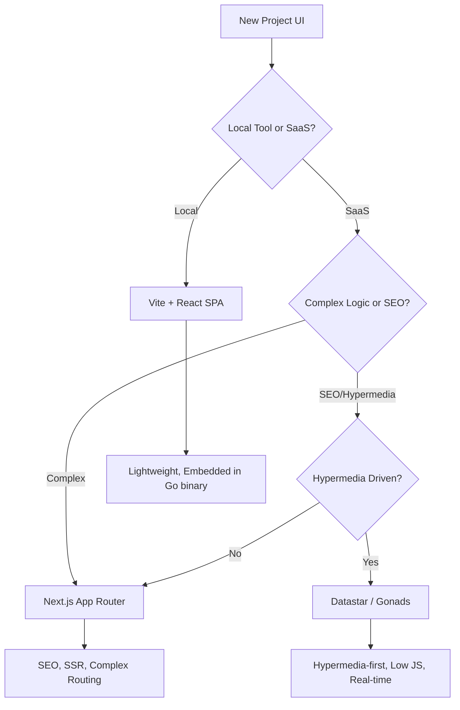

# Core Philosophy & Technical Stack

This document defines the "Gold Standard" technology stack and the decision logic behind our choices.

## 1. Backend: Golang (1.23+)

We prefer Go for core business logic and CLI tools.

*   **Rationale:** Static typing, high performance, excellent concurrency primitives (goroutines/channels), and a robust standard library that minimizes "npm-style" dependency bloat.
*   **Standards:** 
    *   Strict adherence to `gofmt` and `goimports`.
    *   No `init()` functions (explicit wiring only).
    *   Comprehensive use of `context.Context` for cancellation and timeouts.

---

## 2. Frontend Strategy: The Decision Tree

We maintain multiple paths for User Interfaces, selecting the best tool for the project's specific needs.

### 🌳 The Decision Tree



### ⚛️ Vite + React (Local Tools)
*   **Use Case:** Admin panels, local-first tools, agent control planes.
*   **Key Features:** Fast Refresh, small bundle size, can be bundled into a single Go binary using `embed`.

### 🚀 Next.js (Hosted SaaS & Static Sites)
*   **Use Case:** Public-facing applications, blogs, brochure sites, and SaaS products.
*   **Performance Standard:** For static content (blogs/brochures), we target a **99/100 Lighthouse Score**.
*   **Key Features & Best Practices:**
    *   **Server Components (RSC):** Use for everything except interactive elements (forms/buttons).
    *   **Static Export:** Enable `output: 'export'` for purely static sites to deploy to any CDN.
    *   **Optimization Components:**
        *   `next/image`: Aggressively use for automatic WebP/AVIF conversion and lazy loading.
        *   `next/font`: Self-host fonts to eliminate Layout Shift (CLS).
        *   `next/script`: Load third-party scripts off the main thread.

### ⚡ Datastar & Gonads (Hypermedia & Real-time)
*   **Use Case:** Real-time dashboards, interactive UIs where a full SPA is overkill, and hypermedia-driven applications.
*   **Key Features:** Minimal client-side state, server-driven interactions, and deep integration with Go backends.

---

## 3. Advanced Architectural Patterns (Backend)

For complex domain logic, we evaluate the need for specialized patterns.

*   **Standard:** Clean Hexagonal Architecture (Ports & Adapters).
*   **Event Sourcing:** Considered for high-auditability systems or where history is a first-class citizen.
*   **CQRS (Command Query Responsibility Segregation):** Used when read and write performance requirements diverge significantly.
*   **Evaluation:** We examine the specific needs of the project—scale, complexity, and audit requirements—to decide when to move beyond standard CRUD patterns.

---

## 4. Containerization: Docker

We use Docker to eliminate "works on my machine" syndrome.

*   **Local Development:** `docker-compose.yml` should be used to spin up local dependencies (e.g., Postgres, Redis, Localstack) so developers can get started with a single command.
*   **Multi-Stage Builds:** Always use multi-stage Dockerfiles to keep production images minimal and secure.

```dockerfile
# Example Multi-stage build
FROM golang:1.23-alpine AS builder
...
FROM alpine:latest
COPY --from=builder /app/binary .
ENTRYPOINT ["./binary"]
```

---

## 4. Task Management: Taskfile

We replace complex Makefiles with **Task** (`Taskfile.yml`).

*   **Rationale:** YAML-based, cross-platform (no `sh` dependency), supports parallel execution, and allows for internal documentation of commands.
*   **Standard Tasks:**
    *   `task dev`: Starts local dev environment (UI + Backend).
    *   `task test`: Runs the full test suite (TDT + UI).
    *   `task build`: Produces production artifacts.
    *   `task lint`: Runs `golangci-lint` and `eslint`.

---

## 5. Persistence: SQLite to Cloud-Native

Projects prioritize **Local-First** development and simple implementations.

*   **SQLite:** The standard for local development, demo modes, and simple backend implementations. It provides a real SQL environment without the overhead of a managed database.
*   **Transition:** Hexagonal architecture makes the transition from SQLite to Postgres or CloudDB trivial.
*   **Bundle Analysis:** Use `@next/bundle-analyzer` to ensure no accidental bloat.

---

## 6. Local Dev & Demo Modes

To accelerate development and sales/demo cycles, applications must support specialized runtime modes.

*   **Role-Based Entry:** In `local` or `demo` mode, the app should provide a "Role Selection" page that skips the actual login flow. Users simply select the persona they are testing (e.g., Admin, User, Guest).
*   **Security:** These modes must be strictly gated by environment variables and excluded from production builds.
*   **Seeding:** Upon launch, the backend (SQLite or Memory) is seeded with data from the **Hierarchical Fixture Catalog**.
*   **Decoupled State:** While the app functions correctly using the seeded data, it should **not** have two-way binding to the fixture source files. Updates occur in the local database instance only.
*   **Workspace Integration:** Use the local workspace directory (or `.gemini/tmp`) for persistent local storage during these modes.

---

## 7. UI Design & Component Library

We prioritize consistency and speed by leveraging established component libraries.

*   **Primary Resource:** **TailwindPlus MCP Server**.
    *   **Guideline:** Always use the `tailwindplus` MCP server first for design inspiration and component retrieval.
    *   **Workflow:** Search for components (Marketing, Application UI, eCommerce) using `search_component_names` or `list_component_names`, and retrieve the code for the chosen framework (React/HTML/Vue).
*   **Styling:** Tailwind CSS (v3 or v4) is the mandatory styling framework.
*   **Icons:** Use Lucide React (or equivalent for the chosen framework) for a clean, consistent icon set.
