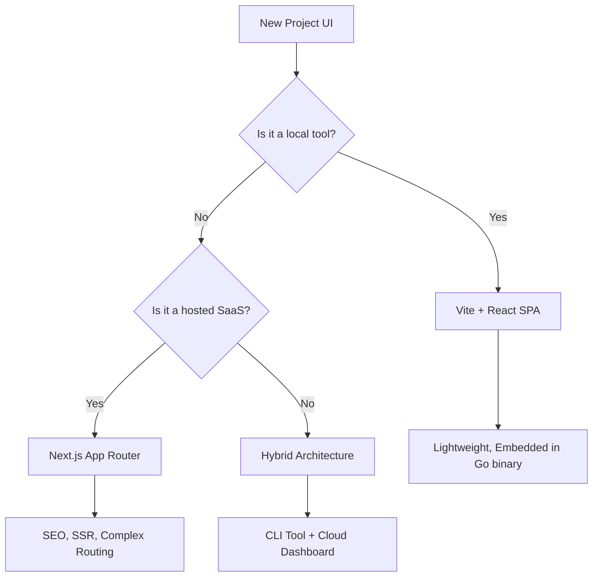

# Core Philosophy & Technical Stack

This document defines the "Gold Standard" technology stack and the decision logic behind our choices.

## 1. Backend: Golang (1.23+)

We prefer Go for core business logic and CLI tools.

*   **Rationale:** Static typing, high performance, excellent concurrency primitives (goroutines/channels), and a robust standard library that minimizes "npm-style" dependency bloat.
*   **Standards:** 
    *   Strict adherence to `gofmt` and `goimports`.
    *   No `init()` functions (explicit wiring only).
    *   Comprehensive use of `context.Context` for cancellation and timeouts.

---

## 2. Frontend Strategy: The Decision Tree

We maintain two primary paths for User Interfaces, depending on the distribution model.

### 🌳 The Decision Tree



### ⚛️ Vite + React (Local Tools)
*   **Use Case:** Admin panels, local-first tools, agent control planes.
*   **Key Features:** Fast Refresh, small bundle size, can be bundled into a single Go binary using `embed`.

### 🚀 Next.js (Hosted SaaS)
*   **Use Case:** Public-facing applications, content-heavy sites.
*   **Key Features:** Server Components, SEO optimization, built-in API routing.

---

## 3. Containerization: Docker

We use Docker to eliminate "works on my machine" syndrome.

*   **Local Development:** `docker-compose.yml` should be used to spin up local dependencies (e.g., Postgres, Redis, Localstack) so developers can get started with a single command.
*   **Multi-Stage Builds:** Always use multi-stage Dockerfiles to keep production images minimal and secure.

```dockerfile
# Example Multi-stage build
FROM golang:1.23-alpine AS builder
...
FROM alpine:latest
COPY --from=builder /app/binary .
ENTRYPOINT ["./binary"]
```

---

## 4. Task Management: Taskfile

We replace complex Makefiles with **Task** (`Taskfile.yml`).

*   **Rationale:** YAML-based, cross-platform (no `sh` dependency), supports parallel execution, and allows for internal documentation of commands.
*   **Standard Tasks:**
    *   `task dev`: Starts local dev environment (UI + Backend).
    *   `task test`: Runs the full test suite (TDT + UI).
    *   `task build`: Produces production artifacts.
    *   `task lint`: Runs `golangci-lint` and `eslint`.

---

## 5. Persistence: Local-First to Cloud-Native

Projects should strive for **Local-First** early on.
*   Start with `MemoryAdapter` or `FileAdapter` (JSON/Cue).
*   Transition to Postgres/CloudDB once the domain logic is stable.
*   Hexagonal architecture makes this transition trivial.
