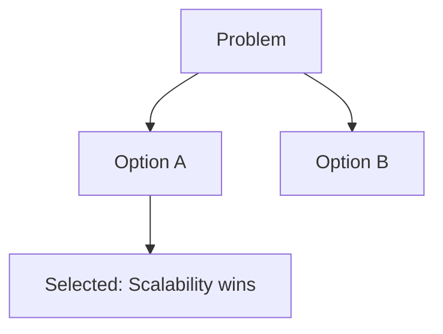

# ADR [XXX]: [Title of Decision]

**Status:** PROPOSED | ACCEPTED | SUPERSEDED
**Date:** [YYYY-MM-DD]
**Author:** [Your Name]

## 1. Context & Problem Statement
[Describe the issue we are facing and why a decision is needed now.]

## 2. Considered Options
*   **Option 1:** [Description]
*   **Option 2:** [Description]

## 3. Decision Outcome
*   **Chosen Option:** [Option X]
*   **Consequences:**
    *   **Positive:** [Benefit 1]
    *   **Negative:** [Trade-off 1]

## 4. Implementation Strategy
[How will this be rolled out?]

## 5. Alternatives Evaluated
| Option | Pros | Cons |
| :--- | :--- | :--- |
| Option 1 | Fast | Not scalable |
| Option 2 | Clean | Complex |

## 6. Mermaid Decision Flow (Optional)

