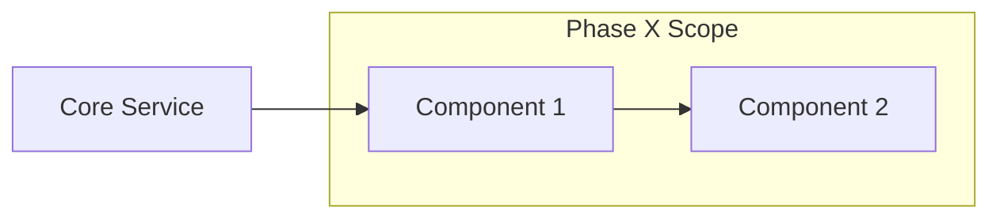

# Phase [X]: [Phase Name] (Implementation Plan)

**Parent Plan:** [MASTER_PLAN.md](../plan/MASTER_PLAN.md)
**Tracker:** [docs/tracking/phaseX_tracker.md]
**Status:** ACTIVE | PENDING | COMPLETE

## 1. Overview
[Summarize the goals of this specific phase and why it's being done now.]

## 2. Architecture Visual
[Show how the components being built in this phase fit together.]

## 3. Implementation Steps

### Step 1: [Task Title]
*   **Goal:** [What are we achieving?]
*   **Action:** [Specific implementation steps]
*   **Checkpoints:**
    *   [ ] Draft Spec
    *   [ ] Approve Spec
    *   [ ] Implementation Pass
    *   [ ] **Commit & Push** 🚀

### Step 2: [Task Title]
*   ...

## 4. Risks & Mitigations
*   **Risk:** [What could go wrong?]
*   **Mitigation:** [How we prevent it]

## 5. Definition of Done
*   [ ] All Specs for this phase are ✅ Verified.
*   [ ] Code coverage for new components > 80%.
*   [ ] All integration tests pass.
