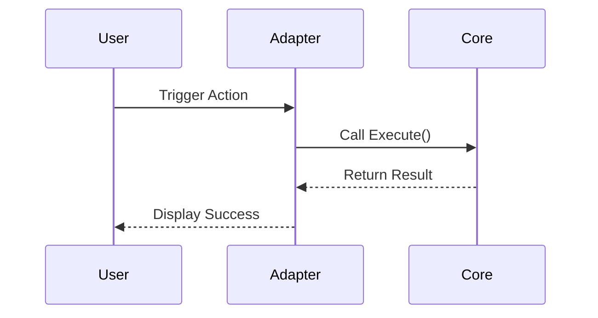

# Specification: [Feature Name]

**Story Ref:** [US-XXX]
**Status:** DRAFT | APPROVED | VERIFIED
**Spec Ref:** [docs/specs/XXX-feature.md]

## 1. Overview
[Briefly describe the feature's purpose and high-level goal.]

## 2. Interface (Port)
[Define the input/output contract. If this is a Core Service, define the Interface.]

```go
type FeaturePort interface {
    Execute(ctx context.Context, req Request) (Response, error)
}
```

## 3. Requirements
*   **Requirement 1:** [Specific behavior]
*   **Requirement 2:** [Constraint or validation rule]

## 4. Interaction Flow
[Describe how this component interacts with others.]



## 5. Test Scenarios (Table-Driven)
[These scenarios MUST be implemented in the TDT test file.]

| Scenario Name | Input Context | Input Data | Expected Result | Expected Error |
| :--- | :--- | :--- | :--- | :--- |
| **Happy Path** | Valid Session | {id: "1"} | Success | nil |
| **Missing Field** | Valid Session | {id: ""} | Error | "id required" |
| **Not Found** | Empty DB | {id: "99"} | Error | "not found" |

## 6. Refs
*   **Test Ref:** `internal/core/services/feature/service_test.go`
*   **Design Ref:** `docs/design/XXX-architecture.md`
