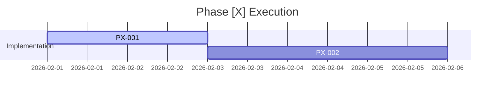

# Phase [X] Tracker: [Phase Name]

**Plan Reference:** [docs/plan/phaseX_plan.md]
**Status Legend:** ⚪ Todo | 🔵 Spec Drafted | 🟣 Spec Approved | 🟠 Test Written | 🟢 Implemented | ✅ Verified

## 📋 Task Dashboard

| ID | Task Description | Story Ref | Spec Ref | Test Ref | Status |
| :--- | :--- | :--- | :--- | :--- | :--- |
| **PX-001** | [Task Title] | [US-001] | [Spec] | [Test] | ⚪ |
| **PX-002** | [Task Title] | [US-002] | [Spec] | [Test] | ⚪ |

## 📈 Progress Visualization

## 📝 Recent Notes / Blockers
*   **[Date]:** [Status update or blocker description]
